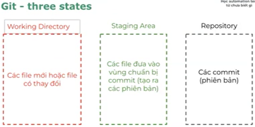

# Lesson 2: GIT & Javascript basic

## I. Version control system

Giúp dễ dàng:
- Xem lịch sử thay đổi
- Quay lại phiên bản trước đó

Có 3 loại VCS:
- Local: lưu ở máy local
- Centralize: lưu ở máy chủ tập trung
- Distributed: lưu ở nhiều máy khác nhau

Phổ biến nhất là Distributed VCS

Git là 1 distributed

## II. Git
- **Tính năng**: dễ dùng, có nhiều tính năng vượt trội: branching, tốc độ xử lý nhanh
- **Chi phí**: Free
- **Phổ biến**: nhiều công ty sử dụng
---
**Git & Github**
|Git|Github|
|---|------|
|Là 1 phần mềm|Là 1 dịch vụ web|
|Cài trên máy local|Host trên web|
|Là 1 command line|Là 1 công cụ có giao diện|
|Là công cụ quản lý phiên bản và đưa file vào git repository|Là nơi để up Git reporitory lên|
|Có các tính năng của version control system|Có các tính năng của version control system và thêm 1 số tính năng (Github Actions, Github co-pilot)|

---
**Git - three states**



- **git init**: (với 1 folder mới) chuyển file từ local sang vùng working directory 
- **git add <tên file>**: chuyển file từ working repository sang vùng staging
- **git commit - m "message"**: chuyển file từ staging sang repository (*phiên bản commit sau sẽ nằm trên phiên bản commit trước*)
---
**Git - cấu hình**
Nếu chưa config user.name và email thì khi commit sẽ lỗi
```
git config --global user.name "tên bạn"
git config --global user.email "email của bạn"
```
--global : config cho toàn bộ nên không cần khởi tạo git (git init)
```
git config user.name "tên bạn"
git config user.email "email của bạn"
```
chỉ set riêng cho 1 repo nên nếu chưa git init sẽ lỗi

---
**Git - 1 số câu lệnh**

**Git status** : xem trạng thái file
- file màu xanh: là vùng staging
- file màu đỏ: là vùng working repository

**Git log** : xem danh sách commit

---
**Git - commit convention**
Trong khi học dùng:
<type>: <short description>	

Type: Loại commit	
- chore: sửa nhỏ lẻ, chính tả, xóa file k dùng tới
- feat: thêm tính năng mới, testcase mới
- fix: sửa lỗi 1 test trước đó

short: mô tả ngắn <50 ký tự = tiếng anh hoặc tiếng việt ko dấu	

## Javascript basic
Javascript là 1 ngôn ngữ lập trình. Giúp cho browser hoạt động được.
Bình thường JS chạy được là do browser engine support.

**Hello World**

Cú pháp: 
- Console.log("nội dung");
- Console.log('nội dung');

Chạy lệnh:	node (path nếu có/)<tên file>

Comment dòng:	// 

Comment nhiều dòng:		Bôi đen , Ctrl+/ hoặc /* */

---
**Biến và hằng**

Biến là khái niệm cơ bản nhất trong lập trình. 
Biến trong biến thiên, có nghĩa là thay đổi được
```
var centerName = "ABC";
let isLovePlaywright = true;
console.log(centerName);
console.log(isLovePlaywright);
```
**var và let khác nhau thế nào?**

let là cú pháp ra đời sau, an toàn hơn. 
var ra đời trước, cú pháp cũ ít sử dụng

* var cho phép khai báo lại, còn let thì không	
```	
	var x = 1;	
	var x = 2; //OK	
		
	let y = 1;	
	let y = 2; //Lỗi: Identifier 'y' has already been declared	
```		
với 1 đoạn code dài có thể quên rằng đã khai báo trc đó -> có thể nhầm lẫn	
* var có phạm vi global, còn let phạm vi theo block, code nằm trong cặp ngoặc nhọn đc gọi là block		
	```
    {	
		var a = 10;
		let b = 11;
	}	
	console.log(a); // in ra 10	
	console.log(b); // in ra lỗi: ReferenceError: b is not defined	
    ```
---
**Hằng** là các giá trị không thay đổi được (hằng số).	
Hằng dùng để khai báo các giá trị không có nhu cầu thay đổi hoặc giá trị chỉ dùng 1 lần	

const slogan = "Học kỹ - Hiểu bản chất"
	
**Khi nào dùng biến, khi nào dùng hằng?	**
- Mặc định dùng const - giúp code an toàn hơn
- chỉ dùng let khi chắc chắn cần gán lại giá trị
- Không dùng var

---
**Kiểu dữ liệu**

1 biến/hằng luôn có kiểu dữ liệu

Trong JS có 8 kiểu dữ liệu chia làm 2 nhóm chính:	
- Nhóm nguyên thủy:	
	- Number
	- String
	- Boolean
	- Undefined
	- Null
	- Symbol
	- BigInt
- Nhóm tham chiếu:	
	- Object

**Number** Số nguyên và số thực (ko phân biệt Int/float)
- const age = 25;   // số nguyên
- const price = 19.99;  // số thực
- const infinity = Infinity;  // vô hạn
- const notANumber = NaN;  // ko phải là số

**String**
- const message = `Hello`;  
- const myTemp = `My age is: ${age}`;  //đưa biến vào = ${} và phải dùng dấu backtick ``

**Boolean** Giá trị logic, true / false

**Làm sao để biết 1 biến có kiểu dữ liệu gì?**
- Đọc code xem khai báo thế nào
- Sử dụng hàm typeof
```
typeof <variable>
output: number || string || boolean
```

---
**Toán tử**

**Toán tử so sánh**	

	chia làm 3 nhóm		
	- So sánh bằng		== hoặc ===
	- So sánh không bằng		!
	- So sánh hơn kém		< , > , <= , >=

So sánh == (loose equality) : So sánh giá trị sau khi chuyển đổi kiểu
```
5 == "5"  // true (chuyển string thành number)
5 == "6"  // false (chuyển string thành number)
true == 1 // true (true chuyển thành 1)
false == 0 // true (false chuyển thành 0)
```
So sánh === (strict equality) : So sánh giá trị và kiểu dữ liệu - không chuyển đổi kiểu	
```
5 === "5"  //false (khác kiểu)
true === 1 //false (khác kiểu)
5 === 5   //true (cùng kiểu, cùng giá trị)
```

**Toán tử logic**	

AND && : dùng để kết hợp nhiều điều kiện và trả về boolean
	
**Toán tử 1 ngôi**

- prefix ++x :  toán tử nằm ở phía trước - tăng trước, trả về sau
- postfix x-- :  toán tử nằm ở phía sau - trả về trước và tăng sau
	
**Toán tử toán học** 

+, -, *, /	

(khi chia cho 0 thì sẽ ra infinity)

---
**Câu điều kiện**

Dùng để kiểm tra 1 đoạn logic trước khi chạy. 
Nếu điều kiện đúng mới chạy	

Trong JS có các loại đk:	
- If
- If...else
- If...else if...else

---
**Vòng lặp**

Dùng để lặp lại 1 đoạn logic. Có thể lặp 1 số lần nhất định, hoặc lặp vô hạn, tùy thuộc điều kiện dừng	

Trong JS có các loại vòng lặp	
- for (i)
- for (of)
- for (each)
- for (in)
- while 
- do while

Cú pháp vòng lặp for(i)
```
for (<điều kiện khởi tạo>; <điều kiện lặp>; <cập nhật>) {
    //code
}