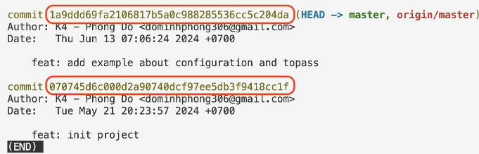

# Lesson 3: GIT & Javascript basic

- **Git:**
    - Undo actions
    - Branching model
- **Javascript**
    - Logical operator
    - Object and array
    - Function

## Git - Undo actions

**Commit message**
- `git commit --amend -m"message"`

**File staging --> Working directory**
- `git restore --staged <file-name>`
- `git restore --staged .` //restore tất cả file

**File repository --> Working directory (un-commit)**
- `git reset HEAD~N` (N: số lượng commit gần nhất)

Commit đầu tiên sẽ không thể bị reset. 

Nếu muốn reset -> xóa thư mục .git rồi init lại.

## Git - Branching

**Git - pull code**
- Lấy code từ server về: `git pull origin main`

**Git - branch**
- Git sử dụng nhánh (branch) để tạo ra những "phiên bản" riêng của code, tránh ảnh hưởng tới bản gốc
- Khi khởi tạo repo (`git init`), nhánh mặc định sẽ được tạo ra
- Cấu hình (bài 1): Khi khởi tại, đặt nhánh mặc định là nhánh main

    `git config --global init.defaultBranch main`

Một số câu lệnh với branch
- Xem danh sách nhánh: `git branch`
    - cần ít nhất 1 commit mới hiện danh sách nhánh
- Tạo nhánh mới: `git branch <tên_branch>`
    - Nhánh mới copy hệt nhánh hiện tại
- Chuyển sang nhánh mới: `git checkout <tên_branch>`
- Vừa tạo, vừa chuyển sang nhánh mới: `git checkout -b <tên_branch>`
- Xóa nhánh: `git branch -D <tên_branch>`
    - lưu ý: đứng ở branch khác trước khi xóa

Lưu ý:
- Luôn pull code mới về trước khi tạo branch mới

**Kiến thức bổ sung**

- Khi dùng lệnh ```git log``` sẽ thấy các commit

- Vùng khoanh đỏ là commit hash hay revision. Để trở về revision ta dùng:

    ```git checkout <revision>```
## Git - ignore file

File **.gitignore** là 1 file cấu hình quan trọng trong Git, giúp bạn chỉ định những file, folder nào sẽ không được theo dõi (untrack) bởi Git

**Tại sao cần .gitignore?**

Trong dự án thường có nhiều file không cần thiết đưa vào Git repository như:
- File tạm thời của hệ điều hành (.DS_Store, Thumbs.db)
- Thư mục dependencies (node_modules/, vendor/)
- File build, artifacts (dist/, build/, *.exe)
- File cấu hình cá nhân (IDE settings, environment variables)
- File nhạy cảm (API keys, passwords, certificates)
- File log và database local

**Cú pháp**
- #comment - dòng bắt đầu với # là chú thích
- #ignore file cụ thể : <tên_file> secret.txt
- #ignore tất cả file có extension .log: *.log
- #ignore thư mục: modules/
- #ignore file trong mọi thư mục con: **/*.tmp
- Ngoại lệ không ignore file này (dùng !): !important.log
- Ignore file chỉ ở thư mục gốc: /TODO
- Ignore tất cả file .txt trong thư mục doc: doc/**/*.txt

## Javascript - Convention

Convention giúp:
- Code theo format chung, dễ nhìn
- Người khác trong team dễ đọc code

Một số convention phổ biến:
- **Snake_case**: tạm thời ko dùng
- **kebab-case**: đặt tên file/folder
- **camelCase**: đặt tên biến, hàm
- **PascalCase**: đặt tên class

## Javascript - Object

Object là 1 trong những kiểu dữ liệu quan trọng nhất trong javascript, dùng để lưu trữ dữ liệu dạng key-value

Cú pháp:
```javascript
const/let <variable_name> {
    key1: value1,
    key2: value2,
}
```
- **key** : giống quy tắc đặt tên biến
- **value** : có kiểu giống biến hoặc 1 object khác

Object = đối tượng, dùng để lưu trữ tập hợp các giá trị vào cùng 1 biến hoặc hằng số

**Kiến thức bổ sung**

- Khi dùng const, giá trị sẽ không thay đổi được. Ví dụ:
```javascript
const a = 10;
a = 15; //lỗi
```
- Đối với Object cũng vậy, nếu thay cả 1 object bằng 1 object mới thì cũng sẽ lỗi
```javascript
const student = {name: "Alex", age: 30}
student = {name: "Nagi", age: 30} //lỗi
```
- Tuy nhiên nếu chỉ thay đổi các thuộc tính của object thì hợp lệ
```javascript
const student = {name: "Alex", age: 30}
student.name = "Nagi" //hợp lệ
```
- Thêm thuộc tính mới vào object
```javascript
let bike = {
    make: "Yamaha",
    model: "ABC"
};

bike.color = "Red";
bike["price new"] = 100;

console.log(bike);
//Ket qua
{make: "Yamaha", model: "ABC", color: "Red", "price new" = 100}
```
- Xóa thuộc tính
```javascript
delete bike.modal;
console.log(bike);
//Ket qua
{make: "Yamaha", color: "Red", "price new" = 100}
```

## Javascript - Array

```javascript
// Khai bao mang

const arr = ["HoangAnh", "Thao", "Phuong", , 8, true];
//index           0         1        2    3  4    5
console.log("Do dai cua mang la", arr.length);
console.log("Gia tri index 5 la", arr[5]);
```
**Kiến thức bổ sung**

Đưa thêm phần tử vào mảng, ta dùng hàm push
```javascript
const arr = [1, 2];
arr.push(3);
console.log(arr);
//Ket qua
[1, 2, 3]
```
## Javascript - Function

Function = hàm, là đoạn code được đặt tên và có thể tái sử dụng, thực hiện 1 nhiệm vụ hoặc tính toán cụ thể.
```javascript
// Khai bao Ham sum(a, b)
function sum(a, b) {
    const sum = a + b;
    return sum;
}
const total = sum(5, 7);
console.log(total);
console.log(sum(2, 3));
```