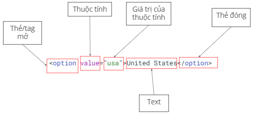

# Lesson 5: DOM terminology Playwright basic
## Agenda
1. Function advance
2. DOM
3. Selector
4. Playwright basic syntax

## Javascript
**Function advance**
- Function expression
- Lambda function
- Anonymous function

---
### Function expression
- Định nghĩa function bằng cách gán nó cho 1 biến
```javascript
// Function declaration (khai báo hàm)
function add(a, b) {
    return a + b;
}

// Function expression (biểu thức hàm)
const add = function(a, b) {
    return a + b;
}

// So sánh cách gọi
console.log(add(2, 3)); // Cả 2 cách đều giống nhau
```
**Thực hành**
1. Khai báo hàm có tham số `name`. Trả về chuỗi `Hello <name>`
2. Khai báo hàm có tham số `price`, `quantity`, `discount`. Trả về giá trị, biết giá trị = price * quantity - discount
```javascript
// 1.
const hello = function(name) {
    console.log(`Hello ${name}`);
}
hello('Anh');
// 2.
const printBill = function(price, quantity, discount) {
    return price * quantity - discount;
}
console.log(`So tien bill: ${printBill(300, 2, 10)}`);
```
---
### Lambda function
(còn gọi là Arrow function)
- Xuất hiện lần đầu trong ES6 (ES2015)
- Đấy là cách viết ngắn gọn hơn cho function
- Sử dụng dấu =>
```javascript
const add = (a, b) => {
    return a + b;
}
```
**Thực hành**
```javascript
// 1.
const hello = (name) => {
    return name
}
hello("Anh");
// 2.
const printBill = (price, quantity, discount) => {
    return price * quantity - discount
}
console.log(`So tien bill: ${printBill(300, 2, 10)}`);
```
**Một số cách viết khác**
- Nếu chỉ có 1 dòng code => có thể "rút gọn" cặp ngoặc nhọn
```javascript
// Cú pháp ngắn gọn nhất (implicit return)
const add = (a, b) => a + b;
```
- Không có tham số
```javascript
// Phải có dấu ngoặc tròn rỗng
const greet = () => console.log('Hello');
const getRandom = () => Math.random();
```
- Một tham số
```javascript
// Có thể bỏ dấu ngoặc tròn
const double = x => x * 2;
const square = x => x * x;

// Hoặc giữ ngoặc (tùy style)
const triple = (x) => x * 3;
```
**Thực hành**
```javascript
// 1.
const hello = name => name;
hello("Anh");
// 2.
const printBill = (price, quantity, discount) => price * quantity - discount;
console.log(`So tien bill: ${printBill(300, 2, 10)}`);
```
### Anonymous function
(hàm ẩn danh)
- function không có tên
- được sử dụng khi function chỉ dùng 1 lần hoặc làm callback
```javascript
// Named function (có tên)
function namedfunction() {
    console.log('I have a name');
}

// Anonymous function (không tên)
function() {  // SyntaxError! Không thể đứng 1 mình
    console.log("I'm anonymous");
}

// Anonymous function phải được sử dụng ngay
// 1. Gán cho biến
const anonymousFunc = function() {
    console.log("I'm anonymous but stored in variable");
};

// 2. Dùng làm callback
setTimeout(function() {
    console.log("Anonymous callback");
}, 1000);
```
---
## DOM
Khi vào 1 website, ta thấy website dưới dạng:
- Các khối text
- Các hình ảnh
- Các liên kết
- Các ô input

Máy tính sẽ "nhìn" ở dưới dạng "cây có cấu trúc"
- Mở cây này bằng cách ấn F12 (Hoặc chuột phải chọn `Inspect`) sau đó chọn tab **Element**
- Cấu trúc này gọi là **DOM** (Document Object Model)


Một element gồm thẻ mở và thẻ đóng
```
<option>United States</option>
```
thẻ tự đóng
```

<br/>
<hr/>
```


### Các thẻ HTML thường gặp
Trên thực tế có rất nhiều loại thẻ khác nhau:
- Thẻ tiêu chuẩn: thẻ do tổ chức uy tín Mozilla định nghĩa
- Thẻ tự định nghĩa: do lập trình viên / website tự định nghĩa

**Thẻ cấu trúc cơ bản**
- `<html>` : thẻ gốc của trang
- `<head>` : Chứa metadata, tiêu đề website, hiển thị Google
- `<body>` : Nội dung của cả website
- `<div>` : Khối/container chung
- `<span>` : Inline container
- `<header>, <footer>, <nav>, <section>` : Thẻ ngữ nghĩa

**Thẻ nội dung**
- `<h1>` đến `<h6>` : Tiêu đề
- `<p>` : Đoạn văn
- `<a>` : Liên kết 
- `` : Hình ảnh
- `<ul>, <ol>, <li>` : Danh sách

**Thẻ Form (Quan trọng cho testing)**
- `<form>` : Biểu mẫu
- `<input>` : Ô nhập liệu (text, password, checkbox, radio,...)
- `<button>` : Nút bấm
- `<select>` và `<option>` : Dropdown
- `<textarea>` : Vùng văn bản nhiều dòng

**Demo các thẻ**

https://material.playwrightvn.com/035-DOM-elements.html
---
## Selector
Automation = tương tác với các phần tử trên web
- Input
- Fill
- Click
- ...

Để tương tác được ta cần tìm các phần tử này. **Selector** là công cụ giúp ta tìm

**Có 3 oại selector thường dùng**
- Xpath
    - Dùng trong hầu hết các trường hợp (99,99%)
    - Đa dạng, có khả năng tìm các phần tử khó
    - Hơi dài
    - vd: `//button[normalize-space() = 'Add to cart']`
- CSS selector
    - Ngắn gọn, performance cao
    - Dùng cho các trường hợp dễ tìm
    - Không linh hoạt bằng xpath
    - vd: `.add-to-cart`
- Playwright selector
    - Chỉ dùng riêng cho Playwright
    - Cú pháp ngắn gọn, không phụ thuộc vào cấu trúc DOM
    - Hướng tới "giống người dùng đang nhìn thấy gì"
    - vd: `page.getByText("Add to cart");`

**Khi nào thì dùng gì?**

Playwright selector > CSS selector > Xpath
- Vẫn cần học cả 3 loại để cân mọi dự án
- Có những dự án thích dùng CSS, hoặc Xpath, ta phải tuân theo
---
**Xpath**
- Xpath = XML path
- Có 2 loại:
    - **Tuyệt đối**: đi dọc theo cây DOM
        - Bắt đầu bởi 1 /
    - **Tương đối**: tìm dựa vào đặc tính
        - Bắt đầu bởi 2 //
        - `//tenthe[@thuoctinh="giatri"]
- Nên dùng xpath tương đối
---
## Playwright basic syntax
Automation = tương tác + verify

Trong bài này, học cách tương tác với 1 phần tử
- Viết 1 test
- Tổ chức thành các step
- Tương tác cơ bản:
    - Navigation
    - Click
    - Fill

**test**: Đơn vị cơ bản để khai báo 1 step
```javascript
import { test } from '@playwright/test';

test('<tên test>', async ({ page }) => {
    //code test
});
```
**step**: Đơn vị nhỏ hơn test, để khai báo từng step của test case
    - Lưu ý: step nên được map 1-1 với testcase để dễ maintain
```javascript
await test.step('tên step', async () => {
    //code here
});
```
**navigate**
```javascript
await page.goto('https://pw-practice.playwrightvn.com/);
```
**locate**: Sử dụng page.locator("<selector">) để chọn phần tử trên trang
```javascript
page.locator("//input[@id='email']");
```
**Click**
```javascript
// Single click
await page.locator("//button").click();

// Double click
await page.locator("//button").dbclick();

// Click chuột phải
await page.locator("//button").click({
    button: 'right'
});

// Click chuột kèm bấm phím khác
await page.locator("//button").click({
    modifiers: ['shift']
});
```
**Input**
- Fill: giống việc paste content vào 1 ô input
```javascript
page.locator("//input").fill('Playwright VN');
```
- pressSequentially: giống việc gõ từng chữ cái vào ô input
```javascript
page.locator("//input").pressSequentially('Playwright VN', {
    delay: 100 //ms
});
```
**Radio / Checkbox**
```javascript
// Lấy giá trị hiện tại đang là check hay không
const isChecked = await page.locator("//input]").isChecked();
        console.log(isChecked);
//check/uncheck
page.locator("//input]").check();
page.locator("//input]").aetChecked(false);
```
**Select**
```javascript
await test.step("Dropdown", async () => {
        await page.locator('//select[@id = "country"]').selectOption("Canada");
    });
```
**Upload file**
```javascript
await test.step("Upload file", async () => {
        await page.locator('//input[@type = "file"]').setInputFiles("tests/data-test/data-test.txt");
    });
```
**Hover**
- Để hover phần tử, dùng hàm hover
```javascript
await page.locator("xpath").hover();
```
**text()**
- Hàm text() dùng để tìm ra phần tử có giá trị tương ứng. 

VD với DOM:
`<div @class="playwright">This is a text</div>`

Để chọn phần tử trên ta dùng:
`//div[text()="This is a text"]`

**contains()**
- Đôi khi trong phần tử html, phần tử sẽ bị thừa khoảng trắng, hoặc giá trị không cố định trong text

`<div> Tôi là Alex </div>` // text có space ở đầu và cuối

`<div> Bây giờ là: 08:07 </div>` // time tùy vào thời điểm truy cập web

- Để chọn các phần tử này, ta dùng `contains(<giá trị>, <giá trị contains>)`

`//div[contains(text(), 'Tôi là Alex')]`

`//div[contains(text(), 'Bây giờ là')]`

**Confirmation dialog**
```javascript
page.on('dialog', async dialog => dialog.accept());
```
Handle dialog phải đặt trước hành động sinh ra dialog


